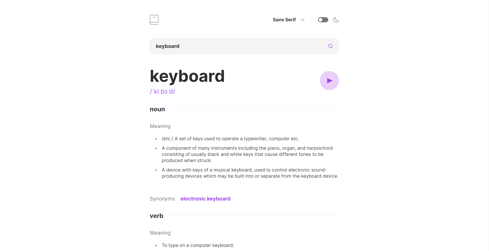

# Frontend Mentor - Dictionary web app 

This is a solution to the [Dictionary web app challenge on Frontend Mentor](https://www.frontendmentor.io/challenges/dictionary-web-app-h5wwnyuKFL).

## Table of contents

  - [The challenge](#the-challenge)
  - [Screenshot](#screenshot)
  - [Links](#links)
  - [Built with](#built-with)
  - [Author](#author)

### The challenge

Users should be able to:

- Search for words using the input field
- See the Free Dictionary API's response for the searched word
- See a form validation message when trying to submit a blank form
- Play the audio file for a word when it's available
- Switch between serif, sans serif, and monospace fonts
- Switch between light and dark themes
- View the optimal layout for the interface depending on their device's screen size
- See hover and focus states for all interactive elements on the page

### Screenshot

### Links

- [Live Site](https://hromus-51.github.io/dictionary-web-app/)

### Built with

- [TS](https://www.typescriptlang.org/)
- [Styled Components](https://styled-components.com/)
- [React](https://reactjs.org/) 
- [Redux Toolkit](https://redux-toolkit.js.org/)
- [Redux Persist](https://www.npmjs.com/package/redux-persist)
- [Framer Motion](https://www.framer.com/motion/)

## Author

- Telegram - [Ilgiz Farrakhov](https://t.me/Gizmo51)
